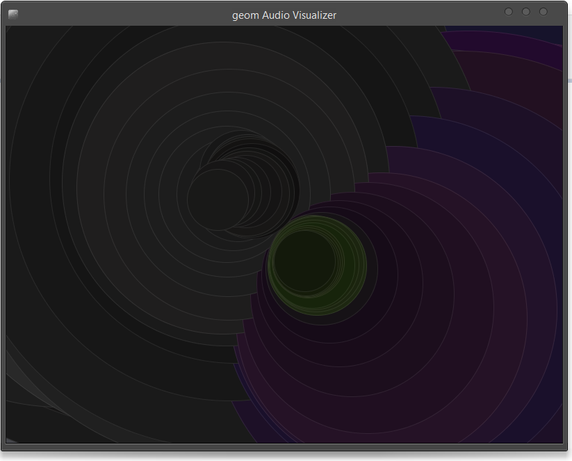

# geom

geom is (currently) a port of [simple_ruby_visualizer](https://github.com/dguttman/simple_ruby_visualizer) in clojure.

It is my attempt at learning [quil](https://github.com/quil/quil) and clojure in general, the code isn't *elegant* as per the Lisp standards, but works.

## Usage

The main sketch is `geom.core` and can be run by lein

```clojure
lein run -m geom.core
;; or
lein run
```

**Output looks something like this**



## License

Copyright © 2014 Abhinav Tushar

Distributed under the Eclipse Public License version 1.0.
